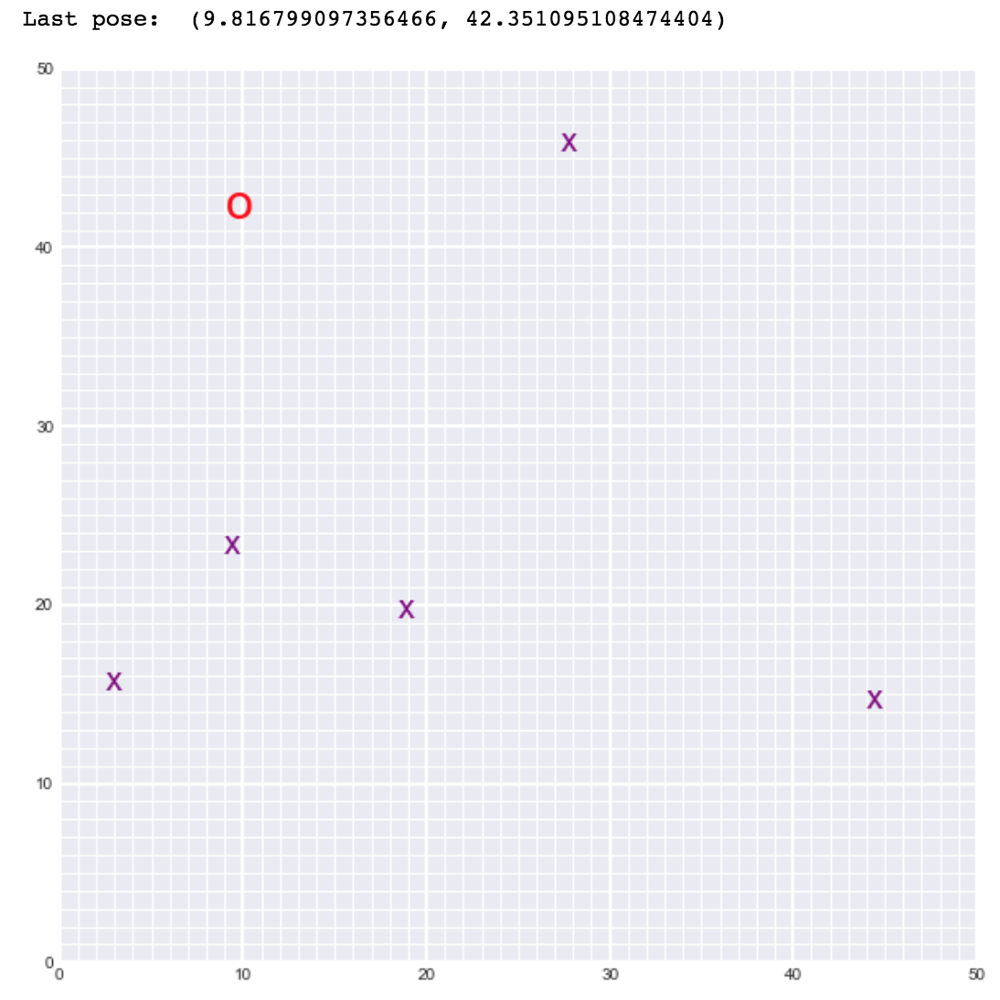

# Graph SLAM (Landmark Detection & Robot Tracking)

## Project Objective

This project is an implementation of SLAM (Simultaneous Localization and Mapping) for a 2 dimensional world, where it tracks the location of a robot and identifies the location of landmarks.

____________________________________________________________________

This is a project from Udacity's computer vision nanodegree

LICENSE: This project is licensed under the terms of the MIT license.